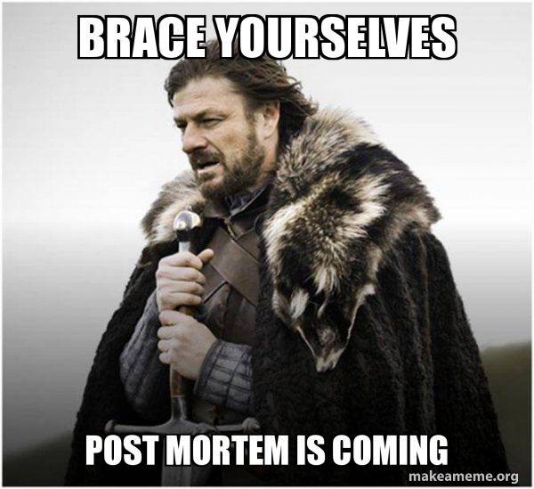
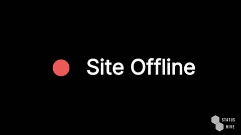
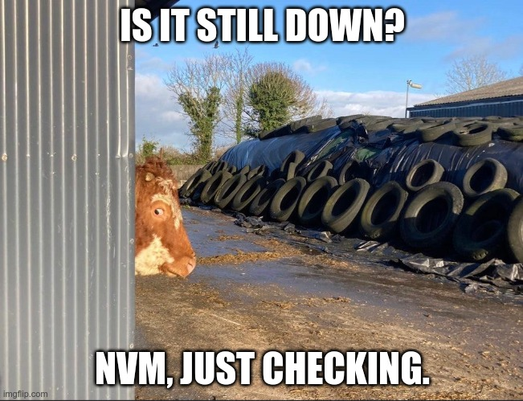

# Postmortem Report: The Great Stockpocalypse of 2024

## Issue Summary

- **Duration of the Outage:**
 - Start: June 6, 2024, 09:00 UTC
 - End: June 6, 2024, 15:30 UTC

- **Impact:**

 - The stock management system was down, halting 90% of warehouse operations. Inventory updates, order processing, and stock tracking were all frozen, leading to significant delays and a lot of stressed-out warehouse workers.

- **Root Cause:**
 - A rogue maintenance script ran amok, corrupting a critical database table and causing a catastrophic system failure.

## Timeline

- **09:00 UTC:** 🛑 Issue detected via monitoring alert—stock management database is on strike!
- **09:05 UTC:** 🚨 On-call engineer paged and caffeinated.
- **09:10 UTC:** 🔍 Initial investigation targets recent system updates.
- **09:20 UTC:** 🎯 Identified a maintenance script executed right before the chaos.
- **09:30 UTC:** 🧭 Misleading path: Suspected hardware issues (spoiler: it wasn't the hardware).
- **10:00 UTC:** 📞 Escalated to the DBA team—cue dramatic music.
- **10:30 UTC:** 🕵️‍♂️ DBA team finds a corrupted table in the database.
- **11:00 UTC:** 🔧 Attempted table repair, but integrity issues persist (the table is having trust issues).
- **12:00 UTC:** 💡 Decided to restore the table from backup (fingers crossed).
- **13:00 UTC:** 🔄 Backup restored, but data verification reveals inconsistencies.
- **14:00 UTC:** 🕵️ Further digging shows backup missed recent transactions.
- **14:30 UTC:** 🕰 Reverted to an older stable backup and manually re-entered missing transactions.
- **15:30 UTC:** ✅ Full service restored—high-fives all around!

## Root Cause and Resolution

### Root Cause

A maintenance script intended to optimize the database instead threw a tantrum, corrupting a critical table and sending the entire stock management system into a tailspin.

### Resolution

1. **Repair Attempt:** Tried fixing the corrupted table, but it was beyond repair.
2. **Backup Restoration:** Restored from the most recent backup, which unfortunately was incomplete.
3. **Manual Data Recovery:** Fell back to an older, more stable backup and manually re-entered missing transactions, like piecing together a jigsaw puzzle.

## Corrective and Preventative Measures

### Improvements and Fixes

1. **Script Validation:** Tighten the leash on maintenance scripts with stricter validation and testing protocols.
2. **Backup Processes:** Supercharge backup processes to ensure they're complete and up-to-date.
3. **Monitoring Enhancements:** Deploy enhanced monitoring for database integrity and set up automated checks to catch corruption early.
4. **Incident Response Training:** Regular training sessions to keep the team sharp and ready for the next stockpocalypse.

### Tasks

1. **Script Review:**
  - Audit and update existing maintenance scripts to prevent future rebellions.
  - Implement a peer review process for all database-related scripts.

2. **Backup Improvements:**
  - Ensure backups are thorough and include recent transactions.
  - Schedule regular integrity checks to make sure backups are reliable.

3. **Monitoring Enhancements:**
  - Deploy tools for monitoring database integrity and set up alerts for suspicious activity.
  - Integrate automated testing of backups to verify their completeness and accuracy.

4. **Training and Documentation:**
  - Conduct regular incident response drills with a focus on database recovery.
  - Update documentation on best practices for database maintenance and troubleshooting.

